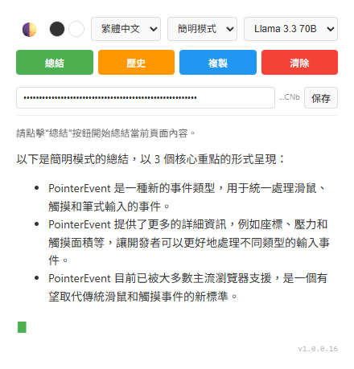

# 🚀 WebSpeedReader (網頁快速閱讀助手)

**WebSpeedReader** 是一款專為效率控設計的 Chrome 擴充套件！⚡️ 它透過 [Groq](https://console.groq.com/) 驅動的多款高速 AI 模型，在幾秒鐘內為您讀完長篇大論，並精煉出最有價值的重點。

---

## ✨ 核心亮點

- 🎯 **聰明選題 (Smart Extraction)**：內建 `Readability.js` 技術，自動過濾網頁廣告、導航欄及雜訊，精準抓取主體文字。
- 📝 **精美渲染 (Markdown Support)**：支援完整 Markdown 語法，總結內容層次分明，重要資訊一目瞭然。
- ⚡️ **極速生成 (Streaming API)**：採用流式傳輸技術，看著 AI 實時「思考」並逐行輸出，不再枯坐等待。
- 🔒 **隱私防護 (Security First)**：API Key 採用加密輸入顯示，並提供尾碼校驗功能，保障您的隱私與安全。
- 📋 **一鍵複製**：生成的總結內容支援 Markdown 一鍵複製，方便直接存入筆記軟體。
- 🤖 **多模型自由切換**：提供多款 Groq 高效能模型（GPT-OSS, Llama 3.3, Mixtral 等）供您選擇。
- 🌐 **雙語支援**：支援繁體中文與英文總結，跨國資訊閱讀零障礙。
- 🌓 **主題與風格自訂**：內建深色模式與三種總結風格（簡明、標準、深度）。
- 📜 **歷史紀錄**：自動保存最近 10 次總結，支援離線回看與快速重載。

---

## 🛠 安裝步驟

1. 下載本專案原始碼。
2. 開啟 Chrome 瀏覽器，進入 `chrome://extensions`。
3. 啟動右側的 **「開發者模式」**。
4. 點擊 **「載入未封裝項目」**，並選擇本資料夾即可！📦

---

## 🔑 開始使用

1. **配置 Key**：至 [Groq Console](https://console.groq.com/keys) 申請免費 API Key。
2. **保存設定**：將 Key 貼入擴充功能頂部並點選 `保存` 💾。（Key 將儲存在本地端，安全無虞）。

3. **一鍵閱讀**：在任何網頁點選 `總結`，AI 就會立即為您服務囉！☕️

### 📝 專案資訊
- **AI 模型**: 多款 Groq AI 模型 (可於介面自選)
- **核心庫**: Readability.js, Marked.js
- **開發者**: chiisen

---

## 🤖 AI Agent 指引

本專案包含 `.agent/GUIDELINES.md` 檔案，這是提供 AI 開發助手（如 opencode）使用的專案開發規範。

**用途**：
- 定義專案技術棧與開發原則
- 確保 AI 生成之程式碼符合專案安全政策（CSP）
- 規範 Git Commit 與 CHANGELOG 格式
- 明確完工定義 (DoD) 以確保品質

> [!IMPORTANT]
> 若使用 opencode 或其他 AI 助手協助開發，請參考 `.agent/GUIDELINES.md` 以確保遵循專案規範。

---
*祝您閱讀愉快！如果有任何問題歡迎反饋 📖✨*
